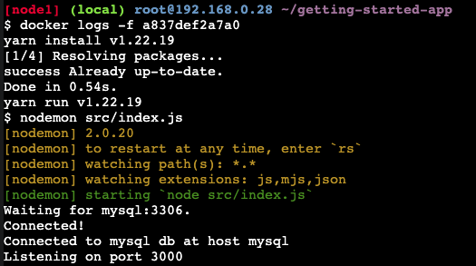

## Parte 6 - Use bind mounts

 
Un bind mount (montaje vinculado) es otro tipo de montaje, que le permite compartir un directorio desde el sistema de archivos del host en el contenedor.

---
### Prueba

 

`$ docker run -it --mount type=bind,src="$(pwd)",target=/src ubuntu bash`

- `--mount` : Opcion que le dice a docker que va a ser un bind mount
- `src` : Directorio de trabajo principal
- `target` : Indica donde ese directorio debe aparecer dentro del contenedor

Una vez ejectado el comando se procede a revisar los archivos de la carpeta src y se crea el archivo *myfile.txt* desde la terminal, se valida en el directorio y efectivamente aparece creado, una vez creado se elimina desde el host y revisando los archivos desde la terminal este ya no aparece.

---
### Contenedores de desarrollo

 
El uso de montajes vinculados es común para las configuraciones de desarrollo local. La ventaja es que la máquina de desarrollo no necesita tener instalados todos los entornos y herramientas de compilación. Con un solo comando de ejecución de Docker, Docker extrae dependencias y herramientas.
  

~~~
docker run -dp 127.0.0.1:3000:3000 \
    -w /app --mount type=bind,src="$(pwd)",target=/app \
    node:18-alpine \
    sh -c "yarn install && yarn run dev"
~~~

Una vez fianalizado su desarrollo, crea una nueva imagen con el comando `docker build -t getting-started .` 
    

## Parte 7 - Multi container apps

Cada contenedor debe hacer una cosa y hacerlo bien. Las siguientes son algunas razones para ejecutar el contenedor por separado:

- Los contenedores separados le permiten versionar y actualizar versiones de forma aislada.
- La ejecución de múltiples procesos requerirá un administrador de procesos (el contenedor solo inicia un proceso), lo que agrega complejidad al inicio/apagado del contenedor.

---
#### Iniciar MySQL

1. Se crea la red con el comando `docker network create todo-app`
2. Iniciar un contenedor MySQL y conectarlo a la red
   
   ~~~
    docker run -d \
        --network todo-app --network-alias mysql \
        -v todo-mysql-data:/var/lib/mysql \
        -e MYSQL_ROOT_PASSWORD=secret \
        -e MYSQL_DATABASE=todos \
        mysql:8.0
   ~~~

    

3. Para conectarse y verificar conexion a base de datos utilizar el comando
   `docker exec -it <mysql-container-id> mysql -u root -p`

   

---
#### Ejecutar la aplicacion con MySQL

1. Se ejecuta la aplicacion asignandole las variables de entorno para la base de datos
    ~~~
    docker run -dp 127.0.0.1:3000:3000 \
    -w /app -v "$(pwd):/app" \
    --network todo-app \
    -e MYSQL_HOST=mysql \
    -e MYSQL_USER=root \
    -e MYSQL_PASSWORD=secret \
    -e MYSQL_DB=todos \
    node:18-alpine \
    sh -c "yarn install && yarn run dev"
    ~~~

    

2. Al ejecutar el comando `docker logs -f <container-id>` se deberia ver la siguiente respuesta
    

    

3. En la aplicacion se agregan algunas tareas 
   

4. Conectarse a la base de datos y verificar que las tareas se hayan guardado correctamente
   

 
 
[Continuar](https://github.com/CindyFonck/Devops_23/blob/main/NestorBecerra/docker.md)