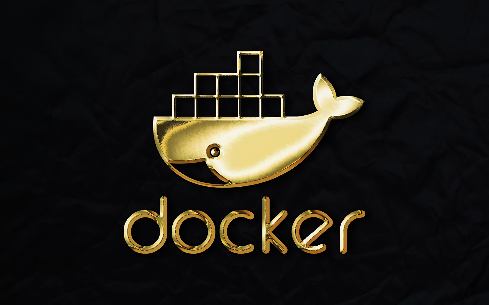

## Language-specific guide

Para esta sección se trabajara con el lenguaje de Node.js, en el cual se explicara como contenerizar una aplicacion realizada en Node.js usando Docker. Este modulo contendra cinco partes, las cuales son:

|           Parte                |                             Enlace                         |
| ----------------------------- | ---------------------------------------------------------- |
| Creacion de contenedores y ejecucion de una aplicacion en Node.js | [Ir al documento](https://github.com/CindyFonck/Devops_23/blob/main/GermanBejarano/Docker_Language/Part1.md) |
| Configurar un entorno de desarrollo para la aplicación en contenedores | [Ir al documento](https://github.com/CindyFonck/Devops_23/blob/main/GermanBejarano/Docker_Language/Part2.md) |
|Ejecutar pruebas de Node.js en un contenedor             | [Ir al documento](https://github.com/CindyFonck/Devops_23/blob/main/GermanBejarano/Docker_Language/Part3.md) |
| Configurar CI/CD para la aplicación Node.js  | [Ir al documento](https://github.com/CindyFonck/Devops_23/blob/main/GermanBejarano/Docker_Language/Part4.md) |  
| Probar la implementación | [Ir al documento](https://github.com/CindyFonck/Devops_23/blob/main//GermanBejarano/Docker_Language/Part5.md) |  