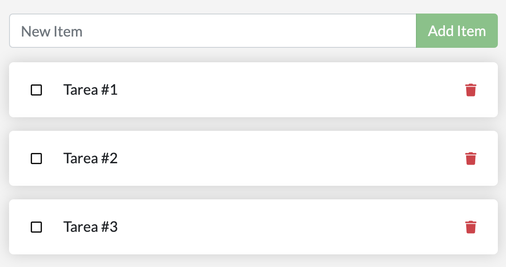
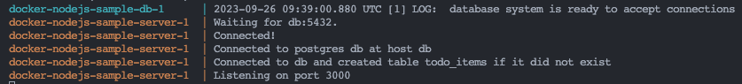
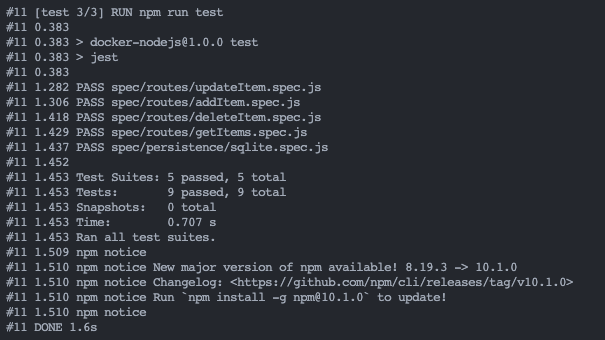
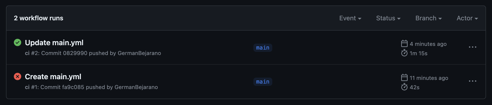
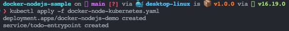
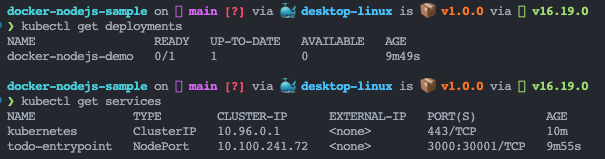

## Language-specific guide

Para esta sección se trabajara con el lenguaje de Node.js, en el cual se explicara como contenerizar una aplicacion realizada en Node.js usando Docker. Este modulo contendra cinco partes, las cuales son:

1. ___Creacion de contenedores y ejecucion de una aplicacion en Node.js___
   
   - Como primera instancia se procede a clonar una aplicacion ya existente desarrollada en Node.js, se utiliza el siguiente comando: `$ git clone https://github.com/docker/docker-nodejs-sample`

   - Como paso opcional se prueba la aplicacion localmente para verificar que se ejecute sin problemas, para esto ejecutamos las lineas de codigo `$ npm install` para instalar las dependencias y `$ node src/index.js` para ejecutarla.
     

     

   - Luego de comprobar que funciona correctamente se procede a ejecutar el comando `$ docker init` el cual ayudara a crear todos los activos necesarios para contenerizar la aplicacion.
     

   - Al ejecutar el comando anterior y configurarlo, se debe crear 3 archivos, un *.dockerignore*, un *Dokerfile* y un *compose.yaml*
  
   - Para ejecutar la aplicación se puede realizar de dos maneras:
     - En terminal: `$ docker compose up --build`
       

     - En segundo plano, la cual no depende de la terminal: `$ docker compose up --build -d` y para detenerla se ejecutaria `$ docker compose down`
        

   
---

2. ___Configurar un entorno de desarrollo para la aplicación en contenedores___
   
   - En este paso se va agregar una base de datos local y hacer las respectivas configuraciones para conservar los datos. Lo primero que se debe de realizar es actualizar el archivo ***compose.yaml*** para agregar las variables de entorno y las  respectivas instrucciones para que sirva la base de datos postgres.
  
        ~~~
        services:
            server:
                build:
                    context: .
                environment:
                    NODE_ENV: production
                    POSTGRES_HOST: db
                    POSTGRES_USER: postgres
                    POSTGRES_PASSWORD_FILE: /run/secrets/db-password
                    POSTGRES_DB: example
                ports:
                    - 3000:3000
                depends_on:
                    db:
                        condition: service_healthy
                secrets:
                     - db-password
            db:
                image: postgres
                restart: always
                user: postgres
                secrets:
                    - db-password
                volumes:
                    - db-data:/var/lib/postgresql/data
                environment:
                    - POSTGRES_DB=example
                    - POSTGRES_PASSWORD_FILE=/run/secrets/db-password
                expose:
                    - 5432
                healthcheck:
                    test: [ "CMD", "pg_isready" ]
                    interval: 10s
                    timeout: 5s
                    retries: 5
            volumes:
                db-data:
            secrets:
                db-password:
                    file: db/password.txt
        ~~~
    - Una vez se actualice el archivo se procede a crear la carpeta ***db*** en la raiz del proyecto, una vez creada se creal el archivo ***password.txt*** y dentro de este se pone una contraseña de su elección, esto se hace porque la variable de entorno `POSTGRES_PASSWORD_FILE` toma la contraseña de ese archivo.
  
    - Para visualizar la aplicacion en funcionamineto ejecutar el comando `$ docker compose up --build` y abrir el navegador con la url `http://localhost:3000` y agregar algunas tareas.
        

    - Para probar que todo quedo correctamente ejecutamos el comando `$ docker compose rm` para eliminar los contenedores y luego se ejecuta el comando `$ docker compose up --build` para ejecutar nuevamente la aplicacion. Cuando revisemos otra vez la url `http://localhost:3000` se debe tener las tareas que se guardaron en el paso anterior.  
        

  
    - Ahora para configurar y ejecutar un contenedor de desarrollo es primordial actualizar el archivo ***Dokerfile*** y el archivo ***compose.yaml*** de la siguiente manera:

        ***Dockerfile***

        `as base`: Le permite hacer referencia a esta etapa de compilación  
        `dev` y `prod`: Etiquetas para etapas de compilación

        ~~~
        ARG NODE_VERSION=16.19.0

        FROM node:${NODE_VERSION}-alpine as base
        WORKDIR /usr/src/app
        EXPOSE 3000

        FROM base as dev
        RUN --mount=type=bind,source=package.json,target=package.json \
            --mount=type=bind,source=package-lock.json,target=package-lock.json \
            --mount=type=cache,target=/root/.npm \
            npm ci --include=dev
        USER node
        COPY . .
        CMD npm run dev

        FROM base as prod
        ENV NODE_ENV production
        RUN --mount=type=bind,source=package.json,target=package.json \
            --mount=type=bind,source=package-lock.json,target=package-lock.json \
            --mount=type=cache,target=/root/.npm \
            npm ci --omit=dev
        USER node
        COPY . .
        CMD node src/index.js
        ~~~

        ***compose.yaml***  

        `target: dev`: Instrucción para apuntar a la etapa ***dev*** del ***Dockerfile***  
        `volumes: -. /src:/usr/src/app/src`: Se agrega nuevo volumen para el montaje de enlace

        ~~~
        services:
            server:
                build:
                    context: .
                    target: dev
                environment:
                    NODE_ENV: production
                    POSTGRES_HOST: db
                    POSTGRES_USER: postgres
                    POSTGRES_PASSWORD_FILE: /run/secrets/db-password
                    POSTGRES_DB: example
                ports:
                    - 3000:3000
                    - 9229:9229
                depends_on:
                    db:
                        condition: service_healthy
                secrets:
                    - db-password
                volumes:
                    - ./src:/usr/src/app/src
            db:
                image: postgres
                restart: always
                user: postgres
                secrets:
                    - db-password
                volumes:
                    - db-data:/var/lib/postgresql/data
                environment:
                    - POSTGRES_DB=example
                    - POSTGRES_PASSWORD_FILE=/run/secrets/db-password
                expose:
                    - 5432
                healthcheck:
                    test: [ "CMD", "pg_isready" ]
                    interval: 10s
                    timeout: 5s
                    retries: 5
        volumes:
            db-data:
        secrets:
            db-password:
                file: db/password.txt
        ~~~

    - Nuevamente se ejecuta el comando `$ docker compose up --build` para correr la aplicacion y cambiamos el label del boton de 'Add item' a 'Add' y se actualiza el navegador en la ruta `http://localhost:3000` y debera verse efectuado el cambio
        

  
--- 

1. ___Ejecutar pruebas de Node.js en un contenedor___
   
   - En esta sección se vera como ejecutar pruebas unitarias en Docker y se presentara dos casos:  
  
     - *Pruebas cuando se desarrolle localmente*: El proyecto ya cuenta con unas pruebas dentro de la carpeta ***spec*** par ejecutarlas se ejecuta el comando `$ docker compose run server npm run test` con lo cual se obtenderia lo siguiente:  

        

     - *Pruebas cuando se compile o se construya*: Para este caso se debe modificar el Dockerfile agregando las siguientes lineas: 
    
        ~~~
        FROM base as test
        ENV NODE_ENV test
        RUN --mount=type=bind,source=package.json,target=package.json \
            --mount=type=bind,source=package-lock.json,target=package-lock.json \
            --mount=type=cache,target=/root/.npm \
            npm ci --include=dev
        USER node
        COPY . .
        RUN npm run test
        ~~~

        Se utiliza `RUN` en cambio de `CMD`, ya que, `RUN` se ejecuta cuando se esta construyendo la imagen y `CMD` cuando ya se ejecuta el contenedor.

        Una vez se modifica el ***Dockerfile*** se procede a ejecutar el siguiente comando para crear una nueva imagen utilizando la etapa de prueba `$ docker build -t node-docker-image-test --progress=plain --no-cache --target test .`

        `--progress=plain`: Ver el resultado de la compilación  
        `--no-cache`: Asegurar que las pruebas siempre se ejecuten  
        `--target test`: Apuntar a la etapa de pruebas

        

--- 

1. ___Configurar CI/CD para la aplicación Node.js___

   Esta seccion se dividira en 3 pasos, los cuales son:

   1. *Crear y configurar el repositorio en GitHub*
   
      1. Crear un repositorio en GitHub
   
         

      2. Ir a DockerHub y generar un Token de acceso con el nombre `node-docker`
      3. Abrir Settings e ir a *Secrets and variables* > *Actions*.
      4. Agregar las siguientes variables:  
   
           - `DOCKER_USERNAME` => Poner como valor el Docker ID 
           - `DOCKERHUB_TOKEN` => Colocar el token de acceso generado en DockerHub

         

      5. Ejecutar el siguiente comando en la terminal teneniendo en cuenta el nombre de usuario de gitHub y el repositorio `$ git remote set-url origin https://github.com/your-username/your-repository.git`
      6. Por ultimo ejecutamos el comando `$ git push -u origin main` y si todo esta correcto deberia subir el repositoria local a GitHub

   2. *Configurar flujo de trabajo*
   
        Para configurar el flujo de trabajo toca dirigirse a la pestaña ***Actions*** y seleccionar la opcion que dice ***set up a workflow yourself***, con esto se abrira un editor en el cual se pegara lo siguiente:

        

        ~~~

        name: ci
        on:
        push:
            branches:
            - main
        jobs:
        build:
            runs-on: ubuntu-latest
            steps:
            -
                name: Checkout
                uses: actions/checkout@v4
            -
                name: Login to Docker Hub
                uses: docker/login-action@v3
                with:
                username: ${{ secrets.DOCKER_USERNAME }}
                password: ${{ secrets.DOCKERHUB_TOKEN }}
            -
                name: Set up Docker Buildx
                uses: docker/setup-buildx-action@v3
            -
                name: Build and test
                uses: docker/build-push-action@v5
                with:
                context: .
                target: test
                load: true
            -
                name: Build and push
                uses: docker/build-push-action@v5
                with:
                context: .
                push: true
                target: prod
                tags: ${{ secrets.DOCKER_USERNAME }}/${{ github.event.repository.name }}:latest
        ~~~

   3. *Ejecurtar el flujo de trabajo*
   
       Por ultimo se confirma los cambios y el flujo de tranajo se iniciara automaticamente. Para revisar el proceso se puede dirigir a la pestaña *Actions*. Una vez se haya completado el proceso y salga exitoso, en el Docker Hub debe aparecer un nuevo repositorio, con lo cual confirmamo que GitHub envio con exito la imagen a Docker Hub.

       

       

---

5. ___Probar la implementación___
   
   En esta seccion se utilizara Docker Desktop par probar la aplicacion en un entorno de Kubernetes. Esto permite probar y depurar sus cargas de trabajo en Kubernetes localmente antes de implementarlas.

   Como primer paso se crea un archivo yaml con el siguiente nombre `docker-node-kubernetes.yaml` en la carpeta raiz del proyecto y se pega el siguiente contenido, teniendo en cuenta el usuario de Docker Hub y el repositorio creado en el paso anterior.

   ~~~
    apiVersion: apps/v1
    kind: Deployment
    metadata:
        name: docker-nodejs-demo
        namespace: default
    spec:
        replicas: 1
        selector:
            matchLabels:
            todo: web
        template:
            metadata:
            labels:
                todo: web
            spec:
            containers:
            - name: todo-site
                image: germanbejarano13/docker
                imagePullPolicy: Always
    ---
    apiVersion: v1
    kind: Service
    metadata:
        name: todo-entrypoint
        namespace: default
    spec:
        type: NodePort
        selector:
            todo: web
        ports:
        - port: 3000
            targetPort: 3000
            nodePort: 30001
   ~~~

   Una vez creado el archivo se procede con su implementacion, para esto ejecutamos el siguiente comando `$ kubectl apply -f docker-node-kubernetes.yaml` y se deberia obtener el siguiente resultado: 

    

   Para asegurar que todo funciono ejecutar `$ kubectl get deployments` y para verificar sus servicios ejecutar `$ kubectl get services`.

   

   Para eliminar toda la aplicacion simplemente se ejecuta `$ kubectl delete -f docker-node-kubernetes.yaml`
