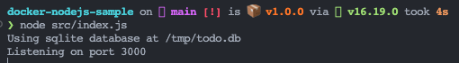
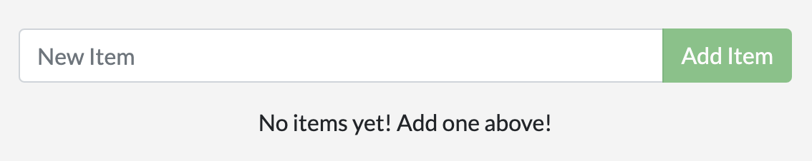
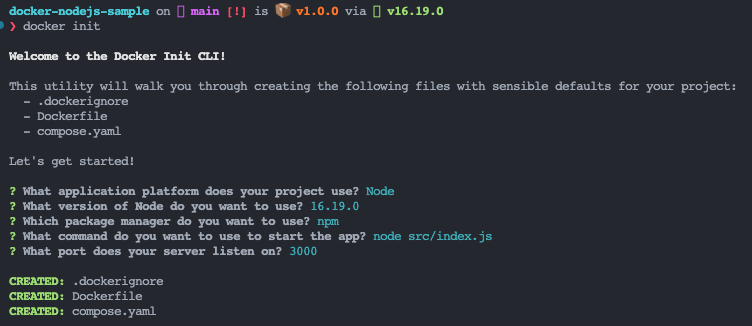

### 1. ___Creacion de contenedores y ejecucion de una aplicacion en Node.js___
   

   - Como primera instancia se procede a clonar una aplicacion ya existente desarrollada en Node.js, se utiliza el siguiente comando: `$ git clone https://github.com/docker/docker-nodejs-sample`

   - Como paso opcional se prueba la aplicacion localmente para verificar que se ejecute sin problemas, para esto ejecutamos las lineas de codigo `$ npm install` para instalar las dependencias y `$ node src/index.js` para ejecutarla.
     

     

   - Luego de comprobar que funciona correctamente se procede a ejecutar el comando `$ docker init` el cual ayudara a crear todos los activos necesarios para contenerizar la aplicacion.
     

   - Al ejecutar el comando anterior y configurarlo, se debe crear 3 archivos, un *.dockerignore*, un *Dokerfile* y un *compose.yaml*
  
   - Para ejecutar la aplicación se puede realizar de dos maneras:
     - En terminal: `$ docker compose up --build`
       

     - En segundo plano, la cual no depende de la terminal: `$ docker compose up --build -d` y para detenerla se ejecutaria `$ docker compose down`
        

   
---

[Continuar](https://github.com/CindyFonck/Devops_23/blob/main/GermanBejarano/Docker_Language/Part2.md)