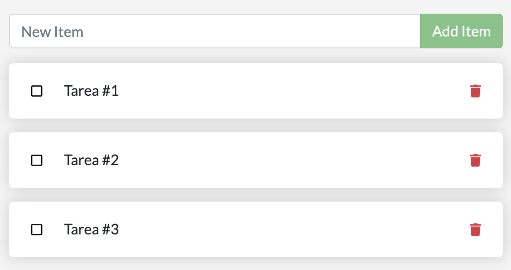
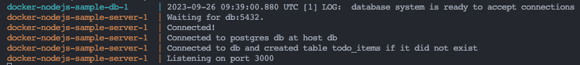
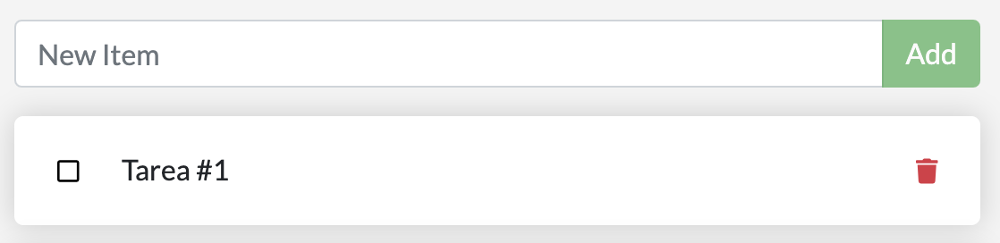

### 2. ___Configurar un entorno de desarrollo para la aplicación en contenedores___
   
   - En este paso se va agregar una base de datos local y hacer las respectivas configuraciones para conservar los datos. Lo primero que se debe de realizar es actualizar el archivo ***compose.yaml*** para agregar las variables de entorno y las  respectivas instrucciones para que sirva la base de datos postgres.
  
        ~~~
        services:
            server:
                build:
                    context: .
                environment:
                    NODE_ENV: production
                    POSTGRES_HOST: db
                    POSTGRES_USER: postgres
                    POSTGRES_PASSWORD_FILE: /run/secrets/db-password
                    POSTGRES_DB: example
                ports:
                    - 3000:3000
                depends_on:
                    db:
                        condition: service_healthy
                secrets:
                     - db-password
            db:
                image: postgres
                restart: always
                user: postgres
                secrets:
                    - db-password
                volumes:
                    - db-data:/var/lib/postgresql/data
                environment:
                    - POSTGRES_DB=example
                    - POSTGRES_PASSWORD_FILE=/run/secrets/db-password
                expose:
                    - 5432
                healthcheck:
                    test: [ "CMD", "pg_isready" ]
                    interval: 10s
                    timeout: 5s
                    retries: 5
            volumes:
                db-data:
            secrets:
                db-password:
                    file: db/password.txt
        ~~~  

- Una vez se actualice el archivo se procede a crear la carpeta ***db*** en la raiz del proyecto, una vez creada se creal el archivo ***password.txt*** y dentro de este se pone una contraseña de su elección, esto se hace porque la variable de entorno `POSTGRES_PASSWORD_FILE` toma la contraseña de ese archivo.
  
- Para visualizar la aplicacion en funcionamineto ejecutar el comando `$ docker compose up --build` y abrir el navegador con la url `http://localhost:3000` y agregar algunas tareas.
        

- Para probar que todo quedo correctamente ejecutamos el comando `$ docker compose rm` para eliminar los contenedores y luego se ejecuta el comando `$ docker compose up --build` para ejecutar nuevamente la aplicacion. Cuando revisemos otra vez la url `http://localhost:3000` se debe tener las tareas que se guardaron en el paso anterior.  
  

  
- Ahora para configurar y ejecutar un contenedor de desarrollo es primordial actualizar el archivo ***Dokerfile*** y el archivo ***compose.yaml*** de la siguiente manera:

    ***Dockerfile***

    `as base`: Le permite hacer referencia a esta etapa de compilación  
    `dev` y `prod`: Etiquetas para etapas de compilación

    ~~~
        ARG NODE_VERSION=16.19.0

        FROM node:${NODE_VERSION}-alpine as base
        WORKDIR /usr/src/app
        EXPOSE 3000

        FROM base as dev
        RUN --mount=type=bind,source=package.json,target=package.json \
            --mount=type=bind,source=package-lock.json,target=package-lock.json \
            --mount=type=cache,target=/root/.npm \
            npm ci --include=dev
        USER node
        COPY . .
        CMD npm run dev

        FROM base as prod
        ENV NODE_ENV production
        RUN --mount=type=bind,source=package.json,target=package.json \
            --mount=type=bind,source=package-lock.json,target=package-lock.json \
            --mount=type=cache,target=/root/.npm \
            npm ci --omit=dev
        USER node
        COPY . .
        CMD node src/index.js
        ~~~

        ***compose.yaml***  

        `target: dev`: Instrucción para apuntar a la etapa ***dev*** del ***Dockerfile***  
        `volumes: -. /src:/usr/src/app/src`: Se agrega nuevo volumen para el montaje de enlace

        ~~~
        services:
            server:
                build:
                    context: .
                    target: dev
                environment:
                    NODE_ENV: production
                    POSTGRES_HOST: db
                    POSTGRES_USER: postgres
                    POSTGRES_PASSWORD_FILE: /run/secrets/db-password
                    POSTGRES_DB: example
                ports:
                    - 3000:3000
                    - 9229:9229
                depends_on:
                    db:
                        condition: service_healthy
                secrets:
                    - db-password
                volumes:
                    - ./src:/usr/src/app/src
            db:
                image: postgres
                restart: always
                user: postgres
                secrets:
                    - db-password
                volumes:
                    - db-data:/var/lib/postgresql/data
                environment:
                    - POSTGRES_DB=example
                    - POSTGRES_PASSWORD_FILE=/run/secrets/db-password
                expose:
                    - 5432
                healthcheck:
                    test: [ "CMD", "pg_isready" ]
                    interval: 10s
                    timeout: 5s
                    retries: 5
        volumes:
            db-data:
        secrets:
            db-password:
                file: db/password.txt
    ~~~

    - Nuevamente se ejecuta el comando `$ docker compose up --build` para correr la aplicacion y cambiamos el label del boton de 'Add item' a 'Add' y se actualiza el navegador en la ruta `http://localhost:3000` y debera verse efectuado el cambio
    

  
--- 

[Continuar](https://github.com/CindyFonck/Devops_23/blob/main/GermanBejarano/Docker_Language/Part3.md)