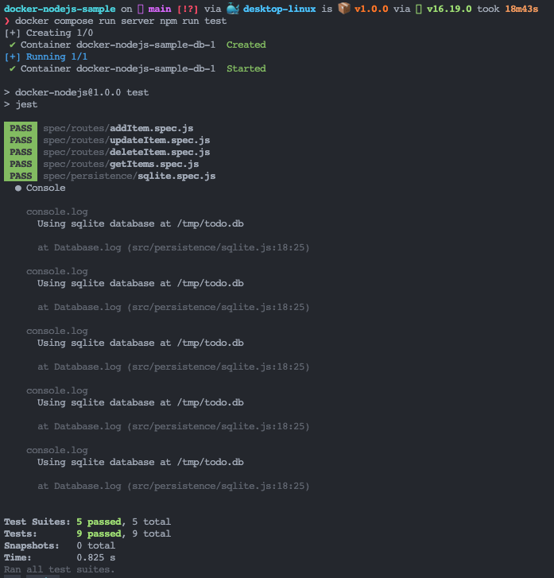
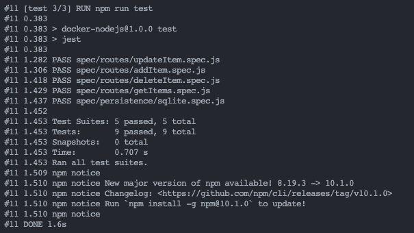

### 3. ___Ejecutar pruebas de Node.js en un contenedor___
   
   - En esta sección se vera como ejecutar pruebas unitarias en Docker y se presentara dos casos:  
  
     - *Pruebas cuando se desarrolle localmente*: El proyecto ya cuenta con unas pruebas dentro de la carpeta ***spec*** par ejecutarlas se ejecuta el comando `$ docker compose run server npm run test` con lo cual se obtenderia lo siguiente:  

        

     - *Pruebas cuando se compile o se construya*: Para este caso se debe modificar el Dockerfile agregando las siguientes lineas: 
    
        ~~~
        FROM base as test
        ENV NODE_ENV test
        RUN --mount=type=bind,source=package.json,target=package.json \
            --mount=type=bind,source=package-lock.json,target=package-lock.json \
            --mount=type=cache,target=/root/.npm \
            npm ci --include=dev
        USER node
        COPY . .
        RUN npm run test
        ~~~

        Se utiliza `RUN` en cambio de `CMD`, ya que, `RUN` se ejecuta cuando se esta construyendo la imagen y `CMD` cuando ya se ejecuta el contenedor.

        Una vez se modifica el ***Dockerfile*** se procede a ejecutar el siguiente comando para crear una nueva imagen utilizando la etapa de prueba `$ docker build -t node-docker-image-test --progress=plain --no-cache --target test .`

        `--progress=plain`: Ver el resultado de la compilación  
        `--no-cache`: Asegurar que las pruebas siempre se ejecuten  
        `--target test`: Apuntar a la etapa de pruebas

        

--- 

[Continuar](https://github.com/CindyFonck/Devops_23/blob/main/GermanBejarano/Docker_Language/Part4.md)