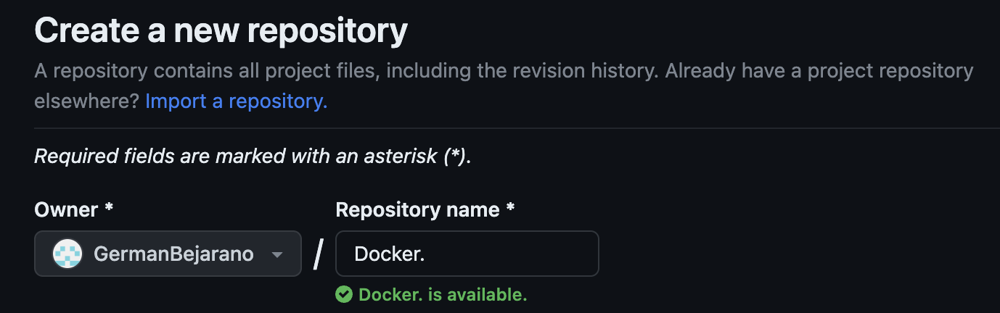

### 4. ___Configurar CI/CD para la aplicación Node.js___

   Esta seccion se dividira en 3 pasos, los cuales son:

   1. *Crear y configurar el repositorio en GitHub*
   
      1. Crear un repositorio en GitHub
   
         

      2. Ir a DockerHub y generar un Token de acceso con el nombre `node-docker`
      3. Abrir Settings e ir a *Secrets and variables* > *Actions*.
      4. Agregar las siguientes variables:  
   
           - `DOCKER_USERNAME` => Poner como valor el Docker ID 
           - `DOCKERHUB_TOKEN` => Colocar el token de acceso generado en DockerHub

         

      5. Ejecutar el siguiente comando en la terminal teneniendo en cuenta el nombre de usuario de gitHub y el repositorio `$ git remote set-url origin https://github.com/your-username/your-repository.git`
      6. Por ultimo ejecutamos el comando `$ git push -u origin main` y si todo esta correcto deberia subir el repositoria local a GitHub

   2. *Configurar flujo de trabajo*
   
        Para configurar el flujo de trabajo toca dirigirse a la pestaña ***Actions*** y seleccionar la opcion que dice ***set up a workflow yourself***, con esto se abrira un editor en el cual se pegara lo siguiente:

        

        ~~~

        name: ci
        on:
        push:
            branches:
            - main
        jobs:
        build:
            runs-on: ubuntu-latest
            steps:
            -
                name: Checkout
                uses: actions/checkout@v4
            -
                name: Login to Docker Hub
                uses: docker/login-action@v3
                with:
                username: ${{ secrets.DOCKER_USERNAME }}
                password: ${{ secrets.DOCKERHUB_TOKEN }}
            -
                name: Set up Docker Buildx
                uses: docker/setup-buildx-action@v3
            -
                name: Build and test
                uses: docker/build-push-action@v5
                with:
                context: .
                target: test
                load: true
            -
                name: Build and push
                uses: docker/build-push-action@v5
                with:
                context: .
                push: true
                target: prod
                tags: ${{ secrets.DOCKER_USERNAME }}/${{ github.event.repository.name }}:latest
        ~~~

   3. *Ejecurtar el flujo de trabajo*
   
       Por ultimo se confirma los cambios y el flujo de tranajo se iniciara automaticamente. Para revisar el proceso se puede dirigir a la pestaña *Actions*. Una vez se haya completado el proceso y salga exitoso, en el Docker Hub debe aparecer un nuevo repositorio, con lo cual confirmamo que GitHub envio con exito la imagen a Docker Hub.

       

       

       Enlace a Imagen en Docker Hub [aqui](https://hub.docker.com/repository/docker/germanbejarano13/docker/general)

---

[Continuar](https://github.com/CindyFonck/Devops_23/blob/main/GermanBejarano/Docker_Language/Part5.md)
