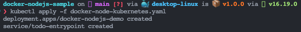
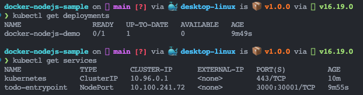

### 5. ___Probar la implementación___
   
   En esta seccion se utilizara Docker Desktop par probar la aplicacion en un entorno de Kubernetes. Esto permite probar y depurar sus cargas de trabajo en Kubernetes localmente antes de implementarlas.

   Como primer paso se crea un archivo yaml con el siguiente nombre `docker-node-kubernetes.yaml` en la carpeta raiz del proyecto y se pega el siguiente contenido, teniendo en cuenta el usuario de Docker Hub y el repositorio creado en el paso anterior.

   ~~~
    apiVersion: apps/v1
    kind: Deployment
    metadata:
        name: docker-nodejs-demo
        namespace: default
    spec:
        replicas: 1
        selector:
            matchLabels:
            todo: web
        template:
            metadata:
            labels:
                todo: web
            spec:
            containers:
            - name: todo-site
                image: germanbejarano13/docker
                imagePullPolicy: Always
    ---
    apiVersion: v1
    kind: Service
    metadata:
        name: todo-entrypoint
        namespace: default
    spec:
        type: NodePort
        selector:
            todo: web
        ports:
        - port: 3000
            targetPort: 3000
            nodePort: 30001
   ~~~

   Una vez creado el archivo se procede con su implementacion, para esto ejecutamos el siguiente comando `$ kubectl apply -f docker-node-kubernetes.yaml` y se deberia obtener el siguiente resultado: 

   Para asegurar que todo funciono ejecutar `$ kubectl get deployments` y para verificar sus servicios ejecutar `$ kubectl get services`.

   

   Para eliminar toda la aplicacion simplemente se ejecuta `$ kubectl delete -f docker-node-kubernetes.yaml`
