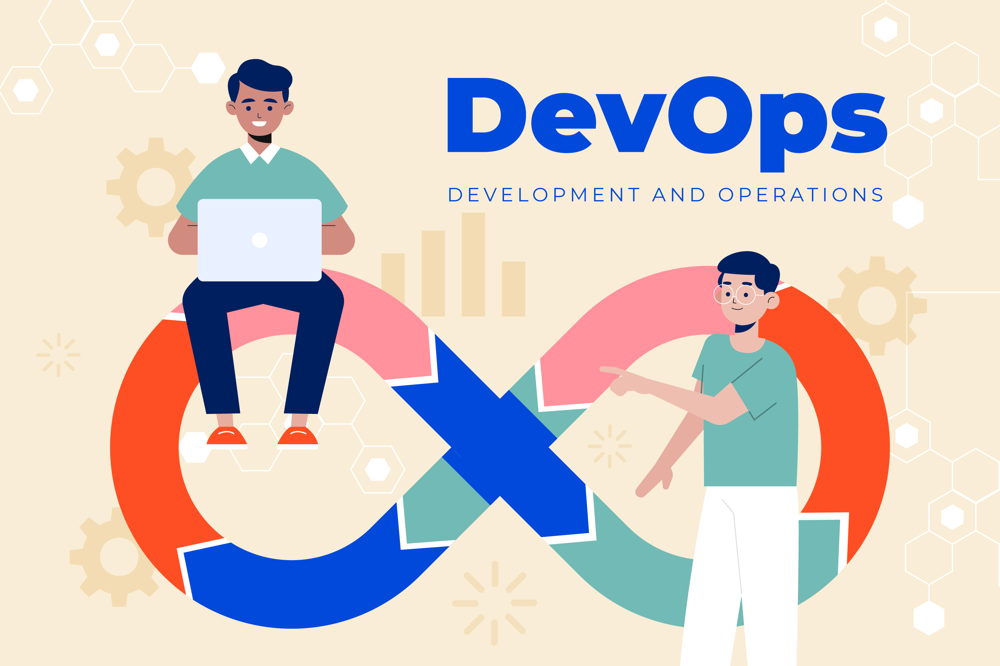

# DevOps

## Ciclo de vida DevOps

El ciclo de vida de DevOps es un serie de procesos de desarrollo automatizados e iterativos que se ejecutan dentro de un ciclo de vida de desarrollo más grande, en el cual se destacan esos seis procesos:

* **_Planificación_**: los equipos determinan las nuevas características y funcionalidades del próximo lanzamiento, a partir de comentarios y casos de estudio de usuarios finales priorizados, así como contribuciones de todos los stakeholders internos.

* **_Desarrollo_**: los desarrolladores prueban, codifican y crean características nuevas y mejoradas, basadas en comentarios de los usuarios y elementos de trabajo en la lista.

* **_Integración (Integración y entrega continua (CI/CD)_**: el nuevo código se integra en el código base existente, luego se prueba y se empaqueta en un ejecutable para su implementación

* **_Implementación_**: la compilación se implementa en un entorno de tiempo de ejecución, generalmente un entorno de desarrollo donde se llevan a cabo pruebas  para garantizar la calidad, la conformidad y la seguridad.

* **_Operaciones_**: garantiza que las características se ejecuten sin problemas y que no haya interrupciones en el servicio. Para ello, verifica que los estados de red, almacenamiento, plataforma, computación y seguridad sean todos correctos

* **_Aprendizaje o retroalimentación_**: recopilación de comentarios de usuarios finales y clientes acerca de las características, la funcionalidad, el rendimiento y el valor empresarial para volver a la etapa de planificación y añadir tanto mejoras como nuevas características al próximo lanzamiento

## Practicas de DevOps

|  |            *Practicas*              |               *Descripción*               | 
| ------------- | --------------------------------- | --------------------------------------- |
| | **Integración continua**          | Practica de desarrollo de software donde los desarrolladores unen los cambios de codigo en un repositorio central de forma periodica, con lo cual se ejecutan versiones y pruebas automaticas.    *Objetivos*   - Encontrar y arreglar errores con mayor velocidad y eficacia   - Mejorar la calidad del software   - Reducir tiempos de validación y publicación de versiones |                              
| | **Entrega continua**              | Es una practica en la cual se compila, prueban y se prepara automaticamente los cambios en código y se entrega a la fase de producción |
| | **Microservicios**                |Es un enfoque de diseño el cual sirve para crear una sola aplicación como conjunto de servicios pequeños. Cada servicio:    - Se ejecuta su propio proceso y se comunica con otros procesos   - Se crean en torno a las capacidades empresariales   - Cada servio es unico y tiene un unico proposito |

## Herramientas de DevOps

El modelo de DevOps depende de herramientas eficaces para ayudar a los equipos a implementar e innovar con rapidez y fiabilidad para sus clientes. Estas herramientas automatizan tareas manuales, ayudan a los equipos a administrar entornos complejos a escala. Algunas de las herramientas son:  

 

|               *Herramienta*               |                             *Descripción*                           |
| --------------------------------- | ---------------------------------------------------------- |
| **Herramientas para gestión de proyectos** |Son las que permiten a los equipos crear una lista de requisitos del proyecto, estos se desglosa en tareas más pequeñas y se le realiza un seguimiento hasta su finalización.   **_Ejemplos_**: Scrum, Lean y Kanban|
| **Repositorios de código fuente de colaboración** |Entornos de codificación de versión controlada que permiten que varios desarrolladores trabajen en la misma base de código.    **_Ejemplos_**: GiHub y GitLab. |
| **Líneas de trabajo CI/CD**       | Herramientas que automatizan la extracción, la creación, la prueba y la implementación de código.   **_Ejemplos_**: Jenkins, CircleCI, ArgoCD|
| **Infraestructuras de automatización de pruebas**     |Incluyen herramientas de software, bibliotecas y mejores prácticas para automatizar pruebas de unidad, contrato, funcionalidad, rendimiento, usabilidad, penetración y seguridad.   **_Ejemplos_**: Selenium, Appium, Katalon, Robot Framework y Serenity |

- - -

## Referencias :

- https://www.redhat.com/es/topics/devops
- https://www.ibm.com/mx-es/topics/devops
- https://aws.amazon.com/es/devops/what-is-devops/

