# Usar Docker Compose 

## Paso 1: Crear un directorio. 

 

 
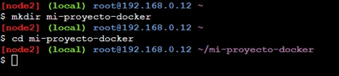

 

## Paso 2: Crear un archivo docker-compose.yml. 

 

  
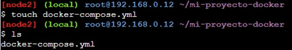

 

 

 

 

## Paso 3: Definir los servicios en docker-compose.yml 

 
 
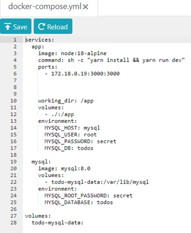

 

 

Este archivo docker-compose.yml define dos servicios: app y mysql. El servicio app utiliza la imagen de node 18 como servidor  y mapea el puerto 3000 del host al puerto 3000 del contenedor. Además, se utiliza un volumen para servir archivos HTML personalizados desde la carpeta ./html en el host. 

El servicio mysql utiliza la imagen de MySQL y configura algunas variables de entorno como la contraseña de root y el nombre de la base de datos. 

 

## Paso 4: Crear la carpeta para los archivos HTML personalizados. 

 
 
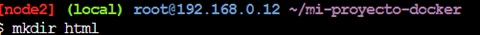

 

 

## Paso 5: Agregar un archivo HTML personalizado. 

 

  
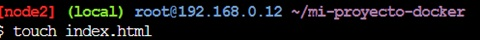

 

## Paso 6: Ejecutar la aplicación. 

 
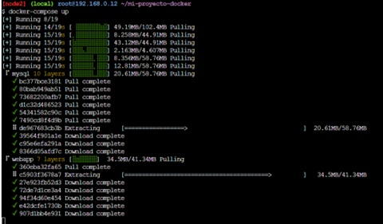

 
 # Mejores Prácticas De Creación De Imágenes

El comando docker image history se utiliza para mostrar el historial de capas de una imagen de Docker. Proporciona información detallada sobre cómo se construyó una imagen, incluyendo las capas y los comandos que se ejecutaron en cada capa.

  
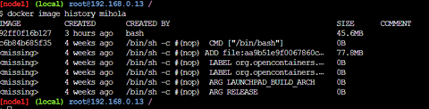

--no-trunc: Este flag o indicador se utiliza para mostrar la salida sin truncar. Cuando se omite este indicador, la salida puede ser truncada, lo que significa que se muestran solo los primeros caracteres de cada línea en el historial de la imagen.

  
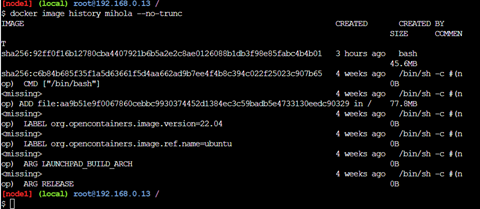

# Almacenamiento en caché de capas

Para reducir el tiempo de compilación de las imágenes Docker utilizando el almacenamiento en caché de capas, puedes seguir estos consejos y buenas prácticas:

-Reordena las instrucciones en tu Dockerfile: Docker utiliza un mecanismo de caché de capas para evitar la repetición de instrucciones en el Dockerfile. Coloca las instrucciones que cambian con menos frecuencia al principio del Dockerfile y las instrucciones que cambian con más frecuencia al final. Esto permite aprovechar la caché para las capas que cambian con menos frecuencia.

Utiliza capas de imagen base eficientes: Elige imágenes base que sean lo más pequeñas y eficientes posible. Imágenes más grandes llevan más tiempo para descargar y construir. A menudo, las imágenes oficiales de Alpine Linux son más pequeñas y rápidas de construir que las imágenes basadas en Ubuntu o CentOS.

Agrupa comandos relacionados en una sola instrucción: En lugar de tener múltiples instrucciones separadas en tu Dockerfile, agrupa comandos relacionados en una sola instrucción. Por ejemplo, en lugar de:
 

Esto reduce el número de capas de imagen.
 

 
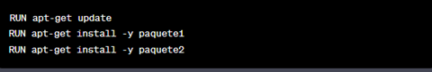

 
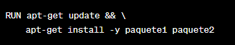

#Construcciones de varias etapas

El uso de construcciones de varias etapas en Docker ofrece varios beneficios significativos que mejoran la eficiencia, el rendimiento y la seguridad de tus imágenes y contenedores Docker. Aquí están algunos de los beneficios clave:
 
**Tamaño de la imagen reducido:** Las construcciones de varias etapas permiten crear imágenes finales más pequeñas al desechar herramientas, bibliotecas y archivos temporales utilizados durante la construcción, que no son necesarios para la ejecución del contenedor. Esto reduce los requisitos de almacenamiento y la superficie de ataque potencial.
 
**Mejor seguridad:** Al eliminar componentes innecesarios y dependencias de las imágenes finales, se reduce la superficie de ataque. Además, las etapas intermedias no tienen acceso a los secretos y credenciales utilizados en la etapa de construcción, lo que mejora la seguridad de tus aplicaciones.
 
**Eficiencia en la construcción:** Las construcciones de varias etapas permiten utilizar capas de caché de forma más eficiente. Cada etapa produce una capa de imagen separada, y Docker puede aprovechar la caché para etapas previas si no ha cambiado nada. Esto acelera significativamente el proceso de construcción.
 
**Facilita la administración de dependencias:** Puedes instalar y gestionar dependencias de desarrollo y herramientas de construcción en etapas de construcción separadas sin preocuparte de que estén presentes en la imagen final. Esto simplifica la gestión de las dependencias y evita la proliferación innecesaria de componentes en la imagen final.
 
**Mejora el mantenimiento:** Las construcciones de varias etapas facilitan la actualización de componentes y dependencias en tu aplicación. Si una dependencia cambia, solo necesitas actualizar la etapa de construcción correspondiente, en lugar de modificar todo el Dockerfile.
 
**Mayor claridad en el Dockerfile:** Dividir la construcción en etapas hace que los Dockerfiles sean más legibles y mantenibles. Cada etapa se centra en una tarea específica, lo que facilita la comprensión de la lógica de construcción.
 
**Adecuado para entornos de CI/CD:** Las construcciones de varias etapas son compatibles con sistemas de integración continua y entrega continua (CI/CD), ya que permiten optimizar la construcción de imágenes y su distribución. Puedes construir imágenes de desarrollo y producción desde el mismo Dockerfile.
 
**Facilita la distribución de artefactos:** Puedes copiar artefactos específicos de una etapa a otra, lo que facilita la distribución de archivos generados en una etapa anterior a la etapa final, lo que es útil en casos como la compilación de aplicaciones.

 
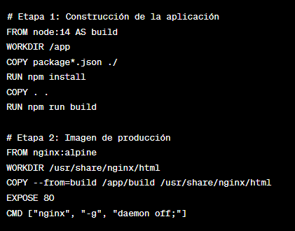

 
