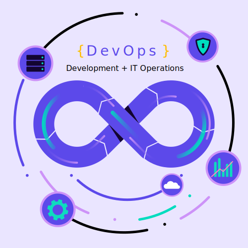

# DevOps
- - -

 
    

- - - 

##### *Institución*: Corporación Universitaria Minuto de Dios
##### *Asignatura*: Diplomado de seguridad en devOps
##### *Carrera*: Ingenieria de Sistemas
##### *NRC*: 41231

- - -

|           Integrantes         |               Temas               |                            Enlace                          |
| ----------------------------- | --------------------------------- | ---------------------------------------------------------- |
| Cindy Fonseca Alvarez         | - Definición - Caracteristicas | [Ir al documento](https://github.com/CindyFonck/Devops_23) |
| Nestor Becerra Sandoval       | - Ventajas - Desventajas       | [Ir al documento](https://github.com/CindyFonck/Devops_23/blob/main/NestorBecerra/Nestor.md) |
| Rafael Cortes Martinez        | - Importancia - Historia       | [Ir al documento](https://github.com/CindyFonck/Devops_23blob/main/RafaelCortes/Rafael.md) |
| German Bejarano Martinez      | - Herramientas - Metodos       | [Ir al documento](https://github.com/CindyFonck/Devops_23) |

