# Paso 4

Para compartir imágenes de Docker, se debe crear un repositorio desde Dockerhub 

Se inicia sesión y seguido a esto se crea un repositorio como se muestra en la imagen

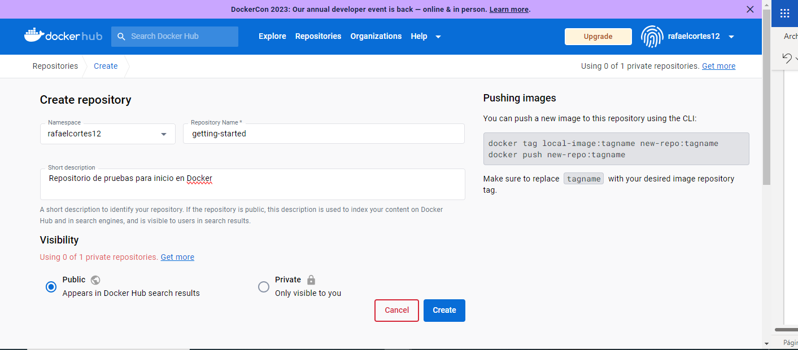

Desde la terminal de docker se inicia sesión de dockerhub para poder conectar el repositorio

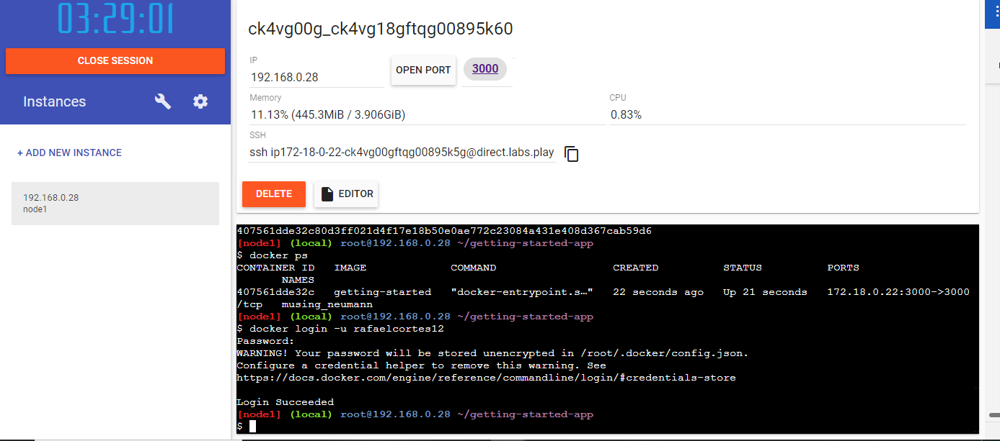

Se usa docker tag para darle un nombre a la imagen

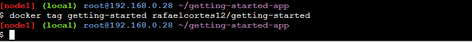

En esta parte se monta la imagen del repositorio en Docker

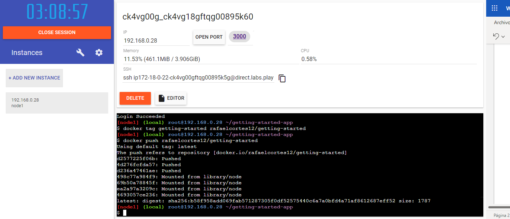

Esta parte se prueba que la imagen este correctamente montada, desde play whith docker, se ejecuta el siguiente comando para iniciar la imagen creada desde otra instancia diferente a la que estamos.

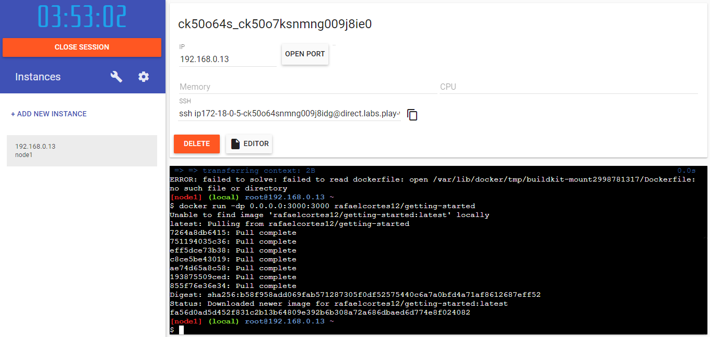

Se especifica el puerto si no aparece para poder ver la imagem 

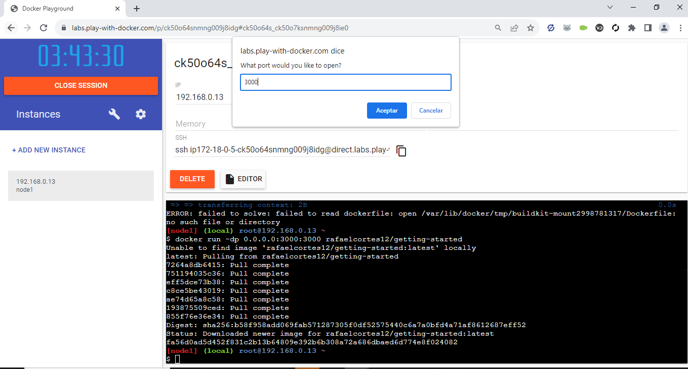

De esta forma abrira la imagen creada desde otra instancia

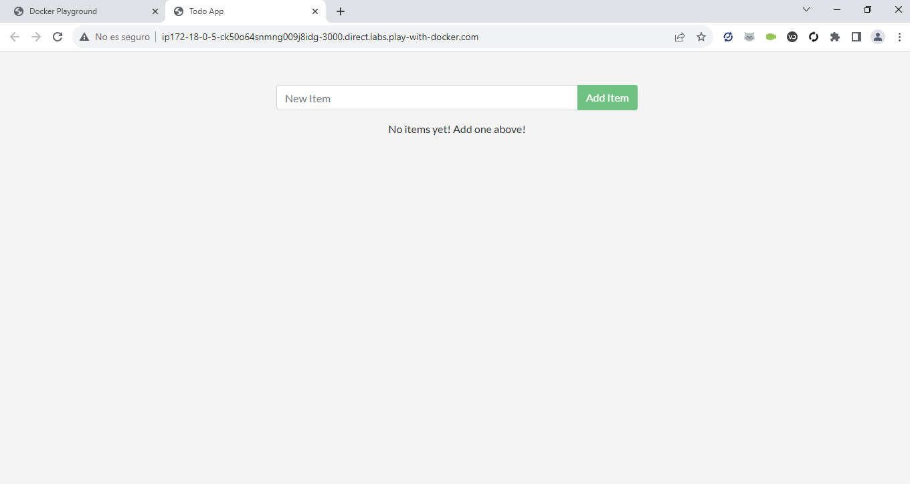

# Paso 5

Para esta parte se crea en el un archivo con unos datos aleatorios

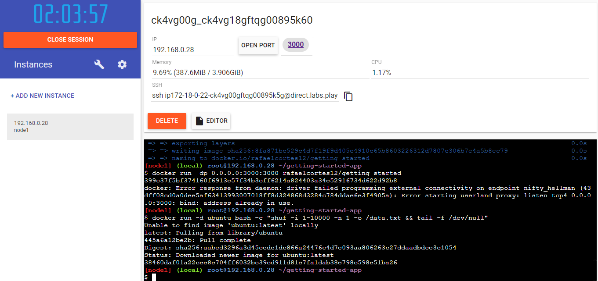

Luego validamos el id del contenedor y vemos el contenido del archivo

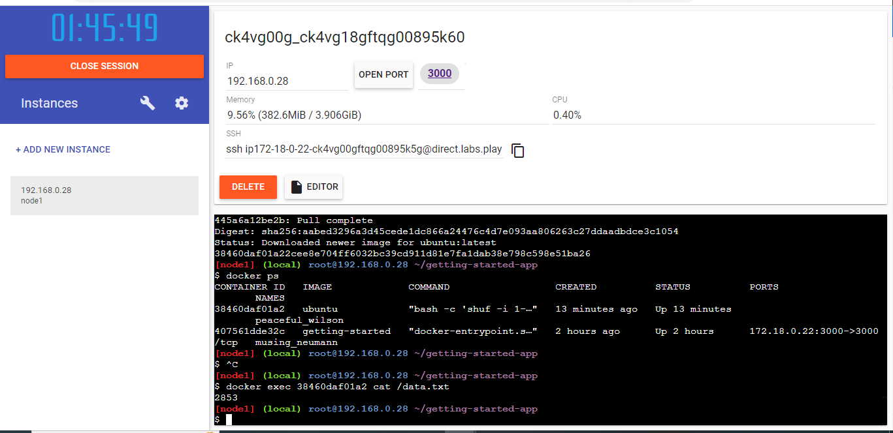

Con el comando ejecutado validamos que tiene el contenedor en su raiz

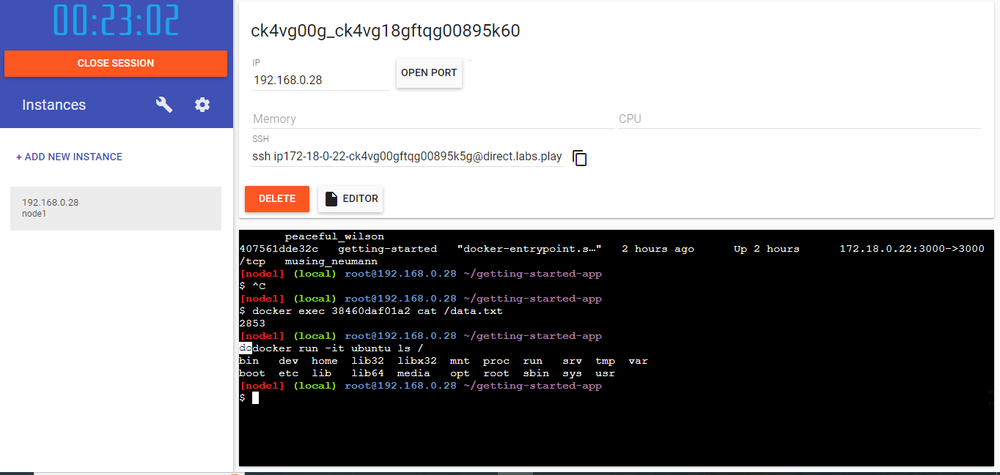

Con el comando ejecutado validamos que tiene el contenedor en su raiz

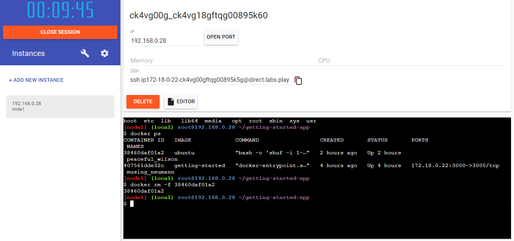

Con este comando se elimina el contenedor que se creo 

