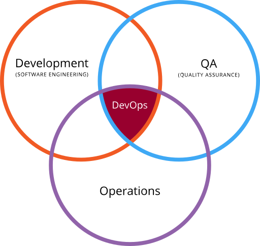

# Importancia

## ¿Por qué es tan importante?

Tras esta definición de DevOps, es el momento de ir un paso más y analizar las razones por las que es muy importante que las empresas se sumen a esta metodología.

Antes de centrarnos en dichos motivos, es interesante destacar que según DevOps.com, el número de compañías que han ido incorporando DevOps ha ido in crescendo cada año más.

Las razones que han contribuido a un mayor desarrollo de DevOps es:

|           Razón               |           Importancia         | 
| ----------------------------- | ----------------------------- |
|**1. Ciclos de desarrollo más cortos que favorecen la innovación**| El hecho de que ambos departamentos, desarrollo y operaciones, se junten, favorece el lanzamiento de nuevas aplicaciones, productos… Es bien conocido que cuanta mayor capacidad de innovación tengan las empresas, mayores posibilidades de adelantarse a sus competidores tendrán. Por lo que favorecerá enormemente su competitividad.|
| **2. Mayor colaboración, mayor comunicación**| Al producirse la unión entre dos equipos, la productividad es mucho mayor. La cultura de DevOps se centra en obtener el mayor rendimiento de dicha unión, en lugar de preocuparse por los objetivos individuales. Fruto de la fusión entre ambos departamentos, el proceso es más fluido, ya que todos están orientados a un objetivo común. Para garantizar que tu equipo DevOp aporta todo su rendimiento, es indispensable crear una cultura de transparencia, conde las responsabilidades sean compartidas y se garantice un feedback rápido.|
| **3. Menores tasas de errores de implementación y acelerar tiempos de recuperación**| La mayor parte de los errores que se producen se deben a fallos de programación. Contar con un equipo DevOp, facilitará que en tiempos más cortos se produzcan más lanzamientos. De esta forma, es más probable y sencillo encontrar posibles defectos en el código. Por esta misma razón, en el caso de que se deba dar solución a cualquier problema, la recuperación será más rápida, gracias al conocimiento e involucración de todos los miembros durante el proceso de desarrollo. |
| **4. Eficiencia: Mejor gestión de los recursos**| El incremento de la eficiencia favorece a que se reduzcan los tiempos de desarrollo y errores o problemas de código. En la actualidad existen sistemas de software que automatizan las tareas de DevOps, reduciendo la necesidad de trabajo manual. ¿Qué significa esto? Que los ingenieros de software podrán dedicarse más a aquellas tareas donde la automatización no tiene cabida.|

# Historia

El movimiento DevOps empezó a fraguarse entre el 2007 y el 2008, cuando las comunidades de operaciones de TI y desarrollo de software se pronunciaron sobre lo que consideraban una disfunción gravísima del sector.

Se alzaron contra el modelo tradicional de desarrollo de software, que exigía que los que escribían el código se mantuvieran al margen, en términos de organización y operación, de los que implementaban y mantenían dicho código.

Los desarrolladores y los profesionales de TI o de operaciones tenían objetivos distintos (y, a menudo, contrapuestos), direcciones de departamento independientes, indicadores clave del rendimiento diferentes por los que se les evaluaba y, con frecuencia, trabajaban en plantas separadas o, incluso, en edificios separados. El resultado eran equipos aislados que únicamente se preocupaban por su ámbito de trabajo, largas jornadas de trabajo, publicaciones chapuceras y clientes insatisfechos. Entonces se dijeron que tenía que haber una forma mejor de hacerlo. Así pues, iniciaron conversaciones conjuntas con personas como Patrick Dubois, Gene Kim y John Willis al frente.

Lo que empezó en foros de internet y reuniones locales es ahora uno de los aspectos principales del ámbito del software actual, y seguramente lo que te ha traído hasta aquí. Tú y tu equipo estáis sufriendo el dolor causado por equipos encasillados y líneas de comunicación rotas dentro de la empresa.

Estás utilizando metodologías ágiles en la planificación y el desarrollo, pero te sigue costando sacar ese código sin montar un drama. Seguro que has oído hablar del modelo DevOps y el efecto aparentemente mágico que puede causar en los equipos: casi todos los equipos de DevOps (el 99 %) se mostraron seguros del éxito del código que estaban produciendo en una encuesta de 500 profesionales de DevOps llevada a cabo por Atlassian¹.

Sin embargo, DevOps no es mágico, y los cambios no se dan de la noche a la mañana. Lo bueno es que no hay que esperar a que la alta dirección lance una iniciativa a gran escala. Teniendo en cuenta el valor de DevOps e implantando pequeños cambios de forma gradual, tu equipo se puede embarcar en el viaje hacia DevOps inmediatamente.

## Linea de tiempo

## Referencias :

- <https://learn.microsoft.com/es-es/azure/developer/mobile-apps/devops>

- <https://www.startechup.com/es/blog/history-of-devops/>
